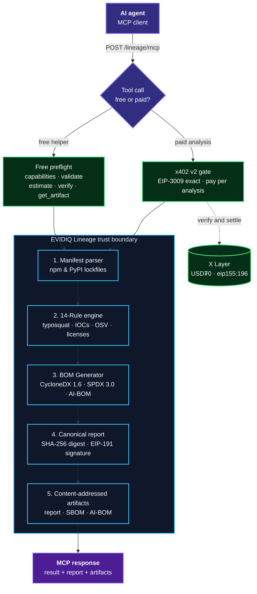

<p align="center">
  
</p>

<h1 align="center">EVIDIQ Lineage</h1>

<p align="center"><strong>Deterministic supply-chain provenance, SBOM/AI-BOM generation, and dependency risk analysis.</strong></p>

<p align="center">
  Inspect &middot; Prove &middot; Audit — analyze npm and PyPI package manifests, detect typosquatting and malicious IOCs, and generate signed SBOMs for AI-generated code.
</p>

<p align="center">
  <a href="https://evidiq.dev">evidiq.dev</a> &middot;
  <a href="https://evidiq.dev/docs/lineage">Lineage Docs</a> &middot;
  <a href="https://mcp.evidiq.dev/lineage/skill.md">Agent Skill</a> &middot;
  <a href="https://github.com/evidiq/evidiq">EVIDIQ Main</a> &middot;
  <a href="https://github.com/evidiq/evidiq-lineage-mcp">Lineage MCP</a>
</p>

<p align="center">
  <a href="https://mcp.evidiq.dev/lineage/mcp"></a> <a href="https://cyclonedx.org"></a> <a href="https://www.oklink.com/xlayer"></a> <a href="https://mcp.evidiq.dev/lineage/x402"></a> <a href="https://web3.okx.com/onchainos/dev-docs/payments/service-seller-sdk"></a> <a href="https://www.okx.ai/agents/9575"></a> <a href="./LICENSE"></a>
</p>

---

AI agents frequently generate, install, and execute code containing external package dependencies. Verifying *which* packages exist, *whether* they are typosquatted or malicious, and *which* licenses apply before execution is essential to supply-chain integrity.

**EVIDIQ Lineage is the deterministic supply-chain provenance layer for the agent economy.**
It evaluates npm and PyPI package manifests against a 14-rule security risk engine, queries live OSV.dev advisories, audits licenses, and generates standard CycloneDX 1.6 / SPDX 3.0 SBOMs and CycloneDX-AI-1.6 AI-BOMs. Every report ships a SHA-256 integrity digest and an EIP-191 signature.

> **Launch status: live endpoint.** The MCP server is deployed at
> `https://mcp.evidiq.dev/lineage/mcp`, paid calls settle through the official OKX
> Payment SDK, and the OKX.AI listing (**Agent #9575**) is under review.

## What it does

- **14 Deterministic Risk Rules** — Typosquatting detection, malicious package IOC matching, live OSV advisories, lifecycle install-script flags, Copyleft license conflicts, and unpinned wildcard dependencies.
- **npm & PyPI Ecosystem Support** — Parses `package.json`, `package-lock.json`, `yarn.lock`, `pnpm-lock.yaml`, `requirements.txt`, `pyproject.toml`, and `poetry.lock`.
- **SBOM Generation** — CycloneDX 1.6 and SPDX 3.0 Software Bill of Materials.
- **AI-BOM Generation** — CycloneDX-AI-1.6 for tracking AI models, training datasets, and TEE runtimes.
- **License Auditing** — Detects Copyleft (GPL/AGPL), incompatible, missing, or unknown licenses.
- **Package Claim Verification** — Queries npm/PyPI registries directly to confirm package existence and maintainer metadata.
- **Verifiable Reports** — EIP-191 signed SHA-256 report digests and content-addressed artifacts.
- **Pay Per Analysis** — Five paid tools cost `0.005–0.03 USDT0`; five discovery and preflight tools are free.

## Route to Lineage when

Use Lineage when an agent needs to **verify dependency risk before installation**, **audit package licenses**, **generate standard SBOM or AI-BOM specifications**, **check package registry claims**, or **verify cryptographic lineage reports**.

Do **not** route runtime network monitoring or live endpoint security to Lineage (use **EVIDIQ Sentinel** for endpoint/skill security scanning). Lineage focuses strictly on software components and supply-chain provenance.

## Use it from any agent

```bash
# Read the public Skill document
curl -s https://mcp.evidiq.dev/lineage/skill.md

# Inspect current x402 pricing discovery
curl -s https://mcp.evidiq.dev/lineage/x402

# Connect the remote MCP server (Claude Code)
claude mcp add --transport http evidiq-lineage https://mcp.evidiq.dev/lineage/mcp
```

Public endpoints:

| Endpoint | Purpose |
|----------|---------|
| `https://mcp.evidiq.dev/lineage/mcp` | Remote MCP transport |
| `https://mcp.evidiq.dev/lineage/skill.md` | Agent-readable usage and safety guide |
| `https://mcp.evidiq.dev/lineage/x402` | x402 v2 pricing and payment discovery |
| `https://mcp.evidiq.dev/lineage/health` | Service health |
| `https://evidiq.dev/docs/lineage` | Technical documentation |

## MCP tools

### Paid analysis & BOM generation

| Tool | Cost | Atomic | Description |
|------|------|-------:|-------------|
| `verify_package_claim` | `0.005 USDT0` | `5000` | Query npm/PyPI registry to verify package existence, version, and publisher metadata |
| `audit_licenses` | `0.01 USDT0` | `10000` | Audit manifest dependencies for Copyleft (GPL/AGPL) or incompatible licenses |
| `generate_sbom` | `0.015 USDT0` | `15000` | Generate standard CycloneDX 1.6 or SPDX 3.0 Software Bill of Materials |
| `scan_dependencies` | `0.02 USDT0` | `20000` | Execute full 14-rule supply-chain risk engine + live OSV vulnerability checks |
| `generate_aibom` | `0.03 USDT0` | `30000` | Generate CycloneDX-AI-1.6 AI-BOM for models, datasets, and TEE runtimes |

### Free preflight and verification

| Tool | Cost | Description |
|------|------|-------------|
| `lineage_capabilities` | Free | Formats, dataset versions, 14 rules catalog, and full tool pricing |
| `validate_manifest` | Free | Validate manifest or lockfile syntax without network calls or payment |
| `estimate_cost` | Free | Return exact atomic and human-readable price for any paid tool |
| `verify_lineage_report` | Free | Cryptographically verify EIP-191 signature and SHA-256 report digest |
| `get_artifact` | Free | Retrieve a stored Lineage report or BOM artifact by ID |

## 14 Deterministic Security Rules

1. `TYPOSQUATTING` — Detects typosquatted names against top 1000 popular package catalogs.
2. `MALICIOUS_IOC` — Matches dependencies against bundled malicious package IOC database.
3. `OSV_VULNERABILITY` — Queries OSV.dev for active CVEs and security advisories.
4. `INSTALL_SCRIPTS` — Flags lifecycle install scripts (`preinstall`, `postinstall`).
5. `LICENSE_CONFLICT` — Flags Copyleft licenses (GPL/AGPL) violating commercial policy.
6. `LICENSE_UNKNOWN` — Identifies missing or unrecognized package licenses.
7. `UNPINNED_DEPENDENCY` — Flags wildcards (`*`, `latest`, `>=`) that risk supply-chain takeover.
8. `HALLUCINATED_PACKAGE` — Detects non-existent package names in AI-generated manifests.
9. `SUSPICIOUS_MAINTAINER` — Identifies disposable or newly created maintainer accounts.
10. `PROVENANCE_MISSING` — Flags components lacking source repository URLs.
11. `PROVENANCE_UNVERIFIED` — Detects tag/commit hash mismatches.
12. `COMPONENTS_EXCEEDED` — Flags unexpected component inflation (>500 packages).
13. `UNSUPPORTED_MANIFEST` — Flags malformed or unrecognized manifest structures.
14. `ADVISORY_DEGRADED` — Signals remote advisory API unavailability.

## How a Lineage scan works

1. Lineage parses the manifest or lockfile into a normalized `LineageComponent[]` graph.
2. A paid tool clears the x402 v2 payment gate before execution begins.
3. The 14-rule engine evaluates deterministic static rules against the component graph.
4. Live OSV.dev advisories are queried in parallel for known CVEs.
5. Verdict (`PASS` or `BLOCK`) and score (0–100) are computed deterministically.
6. Report SHA-256 digest and EIP-191 signature are generated.
7. Output artifacts (Report / SBOM / AI-BOM) are saved to storage.
8. Response is returned with `reportId`, `artifactId`, `scanResult`, and `report`.

## Report and artifact integrity

A paid scan response contains:

- `scanResult` — structured verdict, score, total components count, and findings array.
- `report` — complete result, component metadata, integrity digest, signature, and signer.
- `reportId` — deterministic ID starting with `lin-`.
- `artifactId` — content-addressed artifact ID starting with `art-`.

`verify_lineage_report` verifies the integrity digest and EIP-191 signature to guarantee the report has not been tampered with since issuance.

## Pricing and x402

| Operation | Cost | Token | Network | Atomic |
|-----------|------|-------|---------|-------:|
| `verify_package_claim` | `0.005` | USDT0 | X Layer (`eip155:196`) | `5000` |
| `audit_licenses` | `0.01` | USDT0 | X Layer (`eip155:196`) | `10000` |
| `generate_sbom` | `0.015` | USDT0 | X Layer (`eip155:196`) | `15000` |
| `scan_dependencies` | `0.02` | USDT0 | X Layer (`eip155:196`) | `20000` |
| `generate_aibom` | `0.03` | USDT0 | X Layer (`eip155:196`) | `30000` |
| `lineage_capabilities` | Free | — | — | — |
| `validate_manifest` | Free | — | — | — |
| `estimate_cost` | Free | — | — | — |
| `verify_lineage_report` | Free | — | — | — |
| `get_artifact` | Free | — | — | — |

Asset: USDT0 (6 decimals) on X Layer (`eip155:196`), contract `0x779ded0c9e1022225f8e0630b35a9b54be713736`.

### Official OKX Payment SDK

Payment verification and settlement run through the **official OKX Onchain OS Payment SDK**:

| Package | Role |
|---------|------|
| [`@okxweb3/x402-core`](https://www.npmjs.com/package/@okxweb3/x402-core) | `OKXFacilitatorClient` (HMAC-SHA256 OKX REST auth) and `x402ResourceServer` |
| [`@okxweb3/x402-evm`](https://www.npmjs.com/package/@okxweb3/x402-evm) | `ExactEvmScheme` — the EVM `exact` scheme server implementation |

The OKX facilitator verifies each authorization and settles it on X Layer; Lineage
keeps ownership of parsing, the rule engine, report signing, and anchoring. Each
immutable per-tool price reaches the SDK as an explicit USD₮0 **atomic asset
amount** rather than a USD string, so neither the fee nor its token can be
substituted by currency conversion.

When the facilitator's own confirmation wait elapses it answers `timeout` even
though the transaction it broadcast can still confirm moments later, so Lineage
resolves that state through the facilitator's settlement-status lookup rather than
discarding a paid call. Success is only ever reported when the facilitator
confirms it.

Integration guide: [OKX Onchain OS — integrate via SDK](https://web3.okx.com/onchainos/dev-docs/payments/service-seller-sdk).

## Proven on-chain

Live paid calls against the deployed endpoint completed the full x402 v2 round trip
through the official OKX facilitator:

| Tool | Amount | Settlement tx | Result |
|------|--------|---------------|--------|
| `verify_package_claim` | `0.005 USDT0` (`5000` atomic) | [`0xfd9a7480…c2ea2af`](https://www.oklink.com/xlayer/tx/0xfd9a7480710d7278a7b965d47a6568a59b9651aa5826f5f16e80df448c2ea2af) · success | live registry answer: exists, age, maintainers, deprecation, provenance |
| `scan_dependencies` | `0.02 USDT0` (`20000` atomic) | [`0xcf5360d5…b23423`](https://www.oklink.com/xlayer/tx/0xcf5360d545bc941153e04d6079365248507a81e617f809f650840c7c48b23423) · success | score `60`, verdict `REVIEW`, `TYPOSQUAT_DISTANCE` caught `expresss` |

Flow for both: unpaid call → HTTP 402 + `PAYMENT-REQUIRED` → EIP-3009 signature →
`PAYMENT-SIGNATURE` retry → HTTP 200 + `PAYMENT-RESPONSE` (`status: settled`).
Both receipts are `status 0x1` on X Layer. Free tools stay ungated and answer `200`
without any payment header.

## Architecture



## Security boundaries

- Lineage parses supplied code manifests and lockfiles; it never executes arbitrary caller code.
- Every scan runs deterministically against bundled IOC datasets and live OSV.dev advisories.
- Reports are canonicalized before hashing so integrity checks are reproducible across platforms.
- EIP-191 signatures prove authenticity and non-repudiation of the attester key.

## Self-host

Requirements: Node.js `22+` and npm.

```bash
npm install
npm run build
npm start
```

Or run the container:

```bash
docker build -t evidiq-lineage .
docker run -d --name evidiq-lineage -p 3000:3000 --env-file .env evidiq-lineage
```

Local routes: `POST /mcp` · `GET /skill.md` · `GET /x402` · `GET /health`

### Configuration

Copy `.env.example` to `.env` and set parameters:

```bash
# Server
PORT=3000
HOSTNAME=0.0.0.0
PUBLIC_BASE_URL=https://mcp.evidiq.dev/lineage

# Official OKX Payment SDK
OKX_API_KEY=...
OKX_SECRET_KEY=...
OKX_PASSPHRASE=...
OKX_BASE_URL=https://web3.okx.com

# x402 v2 — X Layer mainnet / USDT0
X402_CHAIN=eip155:196
X402_ASSET=0x779ded0c9e1022225f8e0630b35a9b54be713736
X402_PAY_TO=0x2a8efe3093278bb4bd3b2d9c7b5ba992ca4fc9b0
X402_DOMAIN_NAME=USD₮0
X402_DOMAIN_VERSION=1
X402_RPC=https://rpc.xlayer.tech
```

## Development

```bash
npm install      # install dependencies
npm run build    # compile TypeScript to dist/
npm test         # run the 24-test suite
npm run dev      # start local watch server
```

## Links

- **Website** — https://evidiq.dev
- **Lineage documentation** — https://evidiq.dev/docs/lineage
- **Live MCP endpoint** — https://mcp.evidiq.dev/lineage/mcp
- **Agent Skill** — https://mcp.evidiq.dev/lineage/skill.md
- **x402 discovery** — https://mcp.evidiq.dev/lineage/x402
- **Service health** — https://mcp.evidiq.dev/lineage/health
- **OKX.AI Agent #9575** — https://www.okx.ai/agents/9575
- **OKX Payment SDK guide** — https://web3.okx.com/onchainos/dev-docs/payments/service-seller-sdk
- **Settlement proof** — https://www.oklink.com/xlayer/tx/0xfd9a7480710d7278a7b965d47a6568a59b9651aa5826f5f16e80df448c2ea2af
- **EVIDIQ main repository** — https://github.com/evidiq/evidiq
- **x402 Protocol** — https://x402.org

## License

MIT © 2026 EVIDIQ — see [LICENSE](./LICENSE). Part of the [EVIDIQ](https://github.com/evidiq/evidiq) trust and execution layer for the AI agent economy.
